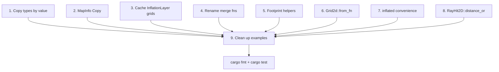

# API Ergonomics and Performance Improvements

## 1. Pass `Vec2`/`UVec2`/`IVec2`/`UVec3` by value

**~25 signatures, ~130 call sites across 21 files.**

All glam vector types are small and `Copy`. Change every method that takes `&Vec2`, `&UVec2`, `&IVec2`, or `&UVec3` to take them by value instead.

Key files with signature changes:

- [src/grid/grid2d.rs](src/grid/grid2d.rs) — 18 methods (`get`, `set`, `get_mut`, `get_unchecked`, `get_unchecked_mut`, `map_to_world`, `world_to_map`, `update_origin`, `update_center`, `resize_map`, `line`, `line_value`, `line_value_mut`, `clear_ray`, `footprint_cost`, `map_to_world_continuous`, `world_to_map_continuous`, private `index`)
- [src/grid/traits.rs](src/grid/traits.rs) — `Grid::get(&self, pos: &UVec3)` and `Grid::set(&mut self, pos: &UVec3, ..)` change to by-value `UVec3`
- [src/iterators/line.rs](src/iterators/line.rs) — 3 iterator constructors (`LineIterator::new`, `LineValueIterator::new`, `LineValueMutIterator::new`): `origin: &Vec2, dir: &Vec2` to by-value
- [src/raycast/dda.rs](src/raycast/dda.rs) — `raycast_dda(origin, dir)` to by-value
- [src/raycast/grid_step.rs](src/raycast/grid_step.rs) — `raycast_grid_step(origin, dir)` to by-value
- [src/raycast/utils.rs](src/raycast/utils.rs) — `in_bounds(cell, bounds)` and `is_occupied(grid, cell)` to by-value

Then fix all ~130 call sites (remove `&` at call sites) across `src/`, `tests/`, `examples/`, and `benches/`.

## 2. Make `MapInfo` `Copy`

In [src/types/info.rs](src/types/info.rs), add `Copy` to the derive:

```rust
#[derive(Debug, Clone, Copy, PartialEq)]
pub struct MapInfo { ... }
```

All existing `.clone()` calls continue to work. No call sites break; this is purely additive. Over time, `.clone()` calls can be removed but this is not required for correctness.

## 3. Cache temp grids in `InflationLayer`

In [src/inflation.rs](src/inflation.rs), the `InflationLayer` struct (line 211) currently has no internal grid storage. `update_costs` (line 261) allocates two `Grid2d<u8>` temps every frame.

Change:

- Add `temp_src: Option<Grid2d<u8>>` and `temp_dest: Option<Grid2d<u8>>` fields to `InflationLayer`.
- In `update_costs`, check if the cached grids match the needed `(w, h, resolution)`. If so, clear and reuse them. If not, allocate new ones and cache.
- Implement `match_size` on the `Layer` trait impl to invalidate the cache when the master grid is resized.

This eliminates ~115 KB of allocation per frame for a 240x240 grid.

## 4. Rename merge functions

In [src/grid/merge.rs](src/grid/merge.rs), rename:

| Current name                                | New name                 |
| ------------------------------------------- | ------------------------ |
| `update_master_overwrite_valid_only`        | `merge_overwrite`        |
| `update_master_max`                         | `merge_max`              |
| `update_master_max_preserve_master_unknown` | `merge_max_keep_unknown` |

Update re-exports in [src/grid/mod.rs](src/grid/mod.rs) and all usage sites:

- [examples/local_costmap_lidar.rs](examples/local_costmap_lidar.rs) (line 28, 100)

No tests currently use these functions directly so the blast radius is small.

## 5. Add `Footprint` helpers

In [src/types/geometry.rs](src/types/geometry.rs), add methods to `Footprint`:

```rust
impl Footprint {
    /// Rectangular footprint centered at the origin.
    pub fn rectangle(length: f32, width: f32) -> Self { ... }

    /// Transform footprint points from robot-local frame to world frame.
    pub fn transform(&self, position: Vec2, yaw: f32) -> Vec<Vec2> { ... }
}
```

`rectangle` creates the 4-vertex polygon `[(+l/2, +w/2), (+l/2, -w/2), (-l/2, -w/2), (-l/2, +w/2)]`.

`transform` rotates each point by `yaw` and translates by `position`, returning world-frame vertices.

Then simplify [examples/footprint_checking.rs](examples/footprint_checking.rs):

- Replace `create_rectangular_footprint()` (line 145-154) with `Footprint::rectangle(ROBOT_LENGTH, ROBOT_WIDTH)`
- Replace `transform_footprint()` (line 156-166) with `footprint.transform(position, yaw)`

## 6. Add `Grid2d::from_fn` constructor

In [src/grid/grid2d.rs](src/grid/grid2d.rs), add:

```rust
pub fn from_fn(info: MapInfo, f: impl FnMut(u32, u32) -> T) -> Self
where
    T: Default,
{
    let w = info.width as usize;
    let h = info.height as usize;
    let data: Vec<T> = (0..h)
        .flat_map(|y| (0..w).map(move |x| (x as u32, y as u32)))
        .map(|(x, y)| f(x, y))
        .collect();
    Self { info, data, fill_value: T::default() }
}
```

Then simplify [examples/footprint_checking.rs](examples/footprint_checking.rs) `create_funnel_costmap()` (lines 111-143) to use `Grid2d::from_fn` instead of manual index math.

## 7. Add convenience `inflate` method on `Grid2d<u8>`

In [src/inflation.rs](src/inflation.rs), add an inherent method:

```rust
impl Grid2d<u8> {
    /// Inflate lethal obstacles with linear falloff, returning a new grid.
    pub fn inflated(&self, radius_m: f32) -> Grid2d<u8> {
        let mut dest = Grid2d::<u8>::empty(self.info().clone());
        inflate(self, &mut dest, radius_m, linear_inflation_cost);
        dest
    }
}
```

This provides a simple one-liner for the common case while keeping the free function `inflate()` for advanced use (custom cost functions, inscribed decay, etc.).

Then simplify [examples/footprint_checking.rs](examples/footprint_checking.rs) lines 45-51 to:

```rust
let inflated = costmap.inflated(INFLATION_RADIUS_M);
```

## 8. Add `RayHit2D::distance_or`

In [src/raycast/mod.rs](src/raycast/mod.rs), add a helper on `Option<RayHit2D>`:

```rust
impl RayHit2D {
    /// Extract hit distance, or return `default` if miss.
    pub fn distance_or(hit: Option<Self>, default: f32) -> f32 {
        hit.map(|h| h.hit_distance).unwrap_or(default)
    }
}
```

Alternatively, a trait extension on `Option<RayHit2D>` would allow `hit.distance_or(max)` syntax, but the associated function is simpler and avoids a new trait. Usage: `RayHit2D::distance_or(hit, MAX_RANGE_M)`.

Update call sites in:

- [examples/local_costmap_lidar.rs](examples/local_costmap_lidar.rs) line 94
- [examples/occupancy_raycast.rs](examples/occupancy_raycast.rs) line 77

## 9. Clean up example imports

In [examples/local_costmap_lidar.rs](examples/local_costmap_lidar.rs), change:

```rust
use costmap::grid::{
    Bounds, CellRegion, Layer, LayeredGrid2d, Pose2, update_master_overwrite_valid_only,
};
```

to use root re-exports where available:

```rust
use costmap::{Bounds, CellRegion, Layer, LayeredGrid2d, Pose2};
use costmap::grid::merge_overwrite; // after rename
```

Also use `Pose2::new(robot_pos, heading)` instead of struct literal on line 142-145.

## Execution order

Tasks are ordered to minimize rework:



Steps 1-8 are independent of each other and can be done in any order. Step 9 (example cleanup) should be last since it depends on the new APIs from all prior steps.
